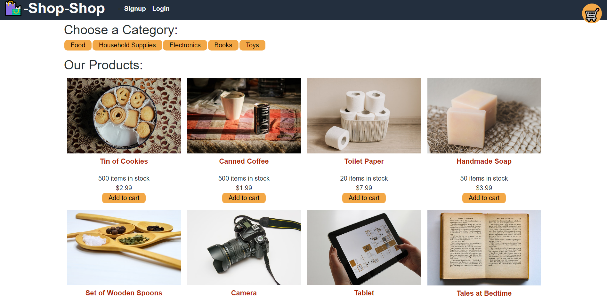
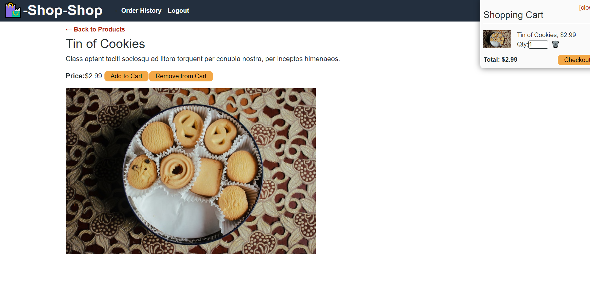

# shop-shop-redux

## Description

This application is a shopping store called "Shop-Shop". Given the starter code which is using ContextAPI in React in order to create state, this version refactors the code to use Redux instead. This application allows a user to signup, login, and then add items to their shopping cart. After items are added, the user can checkout using Stripe. After checkout is completed, the user can look at the order history and is redirected to the homepage. ONce completed, the user can logout.

## Images 
  

## Installation
    React-create-app
## Usage
    For personal use.
## License
    none
## Contributors
    Joanna Grosshans, creator
## Tests
   none
## Questions
jgrossh2  
[GitHub](https://github.com/jgrossh2/shop-shop-redux)  
[Heroku](https://whispering-forest-86996.herokuapp.com)  
Please contact <joannagrosshans2@gmail.com> for additional Information.

# Technologies used
 * JS  
 * React  
 * Redux